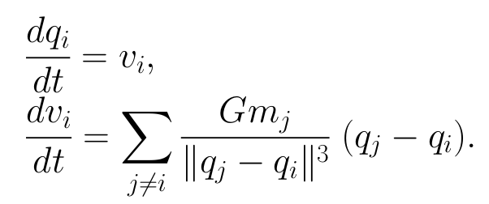
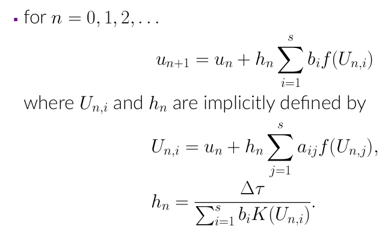
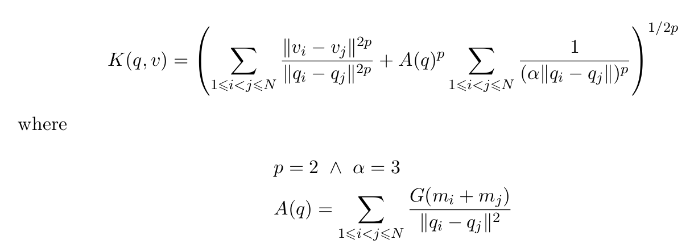

# NbodyIRKGL16.jl :  **few-body integrator with time-reversible adaptivity in Julia**


## Description


We present an integrator for few-body problems  based on [IRKGL16](https://github.com/SciML/IRKGaussLegendre.jl), which incorporates a robust time-reversible adaptivity mechanism that makes it highly performant for the long-term numerical integration of problems with close-encounters. 


## Installation

The package is still unregistered. Use the following command to install it:

```julia
using Pkg
Pkg.add(url="https://github.com/mikelehu/NbodyIRKGL16.jl")  
```

These are the project dependencies that also need to be installed:

```julia
dependencies=["DiffEqBase", "Parameters", "OrdinaryDiffEq", "SciMLBase", "Reexport", "SIMD"]
Pkg.add(dependencies)  
```


After the package is installed, it can be loaded into the Julia session:

```julia
using NbodyIRKGL16 
```

The implementation is designed to handle the integration of N-body problems,

<div style="text-align: center;">

</div>

The definition of the N-body problem that returns the step-size expression is defined 
in [NbodyODE_with_step_size!](./ODEProblems/Nbody.jl) function. 
So, you must define the problem as follows:

```julia
prob = ODEProblem(NbodyODE_with_step_size!, u0, tspan , Gm)
```

After defining a problem, a code example to solve it is: 

```julia
sol=solve(prob, nbirkgl16(), adaptive=true, dt = Dtau)
```


## Solver options


### Available common arguments


- dt:
    - if adaptive=true, dt is a constant and specifies the tolerance (Dtau=dt)
    - if adaptive=false, dt is the step size for the integration

- save_on: specifies whether intermediate solutions are saved (default is true)
- adaptive =true (adaptive timestepping); =false (fixed timestepping)
- maxiters: maximum number of iterations before stopping


### No-common arguments


- initial_extrapolation: initialization method for stages:
    - =true (default): interpolates from the stage values of previous step
    - =false:  uses the simplest initialization


- mstep: output saved at every 'mstep' steps (default mstep=1)

- second_order_ode: 
    - =true (default): integrates a second-order differential equation 
    - = false: for other case

- simd (boolean):
    - =true (default): vectorized implementation only for Float32 and Float64 computations
    - =false: generic implementation that can use arbitrary Julia-defined number systems 


## Return Codes

The solution types have a retcode field which returns a symbol signifying the error state of the solution. The retcodes are as follows:

- ReturnCode.Success: The integration completed without errors.
- ReturnCode.Failure: General uncategorized failures or errors.


## Example: 15-body model of the Solar System
Jupyter notebook :  "/Examples/15-body Solar System integration.ipynb"


We consider the 15-body model of the Solar Systen that includes: the Sun, all eight planets of the Solar System, Pluto and the five main bodies of the asteroid belt.

We consider the initial values at Julian day (TDB) 2440400.5 (the 28th of June of 1969), obtained form the DE430 ephemerides. 

We run a numerical integration back in time for $t=2e7$ days where a close approach between Ceres and Bamberga asteroids occurs.


### Step 1: Defining  the problem

To solve this numerically, define a problem type by specifying the equation, initial
condition, and the timespan to solve over:

```julia
using NbodyIRKGL16 
using Plots, LinearAlgebra
```


```julia
fltype=Float64
u0, Gm, bodylist = Initial15Body(fltype)  # defined in "Initial15Body.jl" file.
N = length(Gm)
show(bodylist)

t0=fltype(0.)
tF=fltype(-2e4)  
tspan= (t0,tF)

# NbodyODE_with_step_size!() is defined in "Nbody.jl" file.
prob = ODEProblem(NbodyODE_with_step_size!, u0,tspan , Gm);
```

### Step 2: Solving the problem


After defining the problem, you solve it using solve

```julia
Dtau=fltype(1.8)
sol=solve(prob, nbirkgl16(), adaptive=true, dt = Dtau)
sol.retcode
```

### Step 3: Analyzing the solution


#### Orbits of planets and asteroids


```julia
pl1 = plot(title="Inner Solar System", 
            xlabel="x", ylabel="y",  aspect_ratio=1)

for j = 2:5
    x  = [u[1,j,1] for u in sol.u]
    y  = [u[2,j,1] for u in sol.u] 
    pl1 = plot!(x,y, label=bodylist[j]) 
end 


pl2 = plot(title="Outer Solar System", 
            xlabel="x", ylabel="y",  aspect_ratio=1)

for j = 6:10
    x  = [u[1,j,1] for u in sol.u]
    y  = [u[2,j,1] for u in sol.u] 
    pl2 = plot!(x,y, label=bodylist[j]) 
end 


pl3 = plot(title="Big asteroids", 
            xlabel="x", ylabel="y",  aspect_ratio=1)

for j = 11:15
    x  = [u[1,j,1] for u in sol.u]
    y  = [u[2,j,1] for u in sol.u] 
    pl3 = plot!(x,y, 
        label="")
end 

src
plot(pl1,pl2,pl3, layout=(1,3), size=(1200,300))
```


#### Error in Energy


```julia
yrange=(1e-18,1e-14)

# NbodyEnergy() is defined in "Nbody.jl" file.
E0=NbodyEnergy(BigFloat.(u0), BigFloat.(Gm))
ΔE = map(x->NbodyEnergy(BigFloat.(x),BigFloat.(Gm)), sol.u)./E0.-1;


pl1=plot(title="Error in Energy", xlabel="t", ylabel="log10(ΔE/E0)",
        titlefontsize=18,
        xtickfont = font(12),
        ytickfont = font(12),
        xticks=([-2e4,-1.5e4,-1e4,-5e3, 0],["-2e4","-1.5e4","-1e4","-5e3", "0"]),
        yscale=:log10,
        legend=:topright, ylims=yrange)

plot!(pl1,sol.t[2:end-1],abs.(ΔE[2:end-1]), color=:red, label="")
```


#### Close encounters between asteroids

```julia
n=length(sol.t)
dist=Array{Vector{Float64}}(undef,5,5)
for i in 1:5
    for j in 1:5
        dist[i,j]=zeros(n)
    end
end

for i in 1:5
    ix=10+i        # indices for asteroids: 11:15
    A=[u[:,ix,1]  for u in sol.u]
    for j in i+1:5
        jx=10+j   # indices for asteroids: 11:15
        B=[u[:,jx,1]  for u in sol.u]
        dist[i,j]=map(x->norm(x), A-B)
    end
end
```

```julia
pl1 = plot(title="Pairwise distances between asteroids", 
           titlefontsize=18,
           xtickfont = font(12),
           ytickfont = font(12),
           yscale=:log10,
           legend=:bottomright,
                   xticks=([-2e4,-1.5e4,-1e4,-5e3, 0],["-2e4","-1.5e4","-1e4","-5e3", "0"]),
           xlabel="t", ylabel="log10(dist)")


for i in 1:5
    for j in i+1:5
        if (i==1 && j==5)
             plot!(pl1, sol.t,dist[i,j], label="Ceres-Bamberga")
        else
            plot!(pl1, sol.t,dist[i,j], label="")
        end
    end
end


pl2= scatter(title="Step size",
             titlefontsize=18,
             xtickfont = font(12),
             ytickfont = font(12),
             xticks=([-2e4,-1.5e4,-1e4,-5e3, 0],["-2e4","-1.5e4","-1e4","-5e3", "0"]),
             xlabel="t", ylabel="h",
             label="",
             sol.t[1:end-2],
             abs.(sol.t[2:end-1].-sol.t[1:end-2]))


plot(pl1,pl2, layout=(1,2), size=(900,300))
```


## Algorithm details

- Time-reversible adaptive NBIRKGL16 algorithm:


  <div style="text-align: center;">
  
  </div>


- We apply $K(u)$ proposed for n-body problem in [1,2],

  <div style="text-align: center;">
  
  </div>

## References

- [1] Reversible Long-Term Integration with Variable Stepsizes,  E.Hairer and  D. Stoffer.
SIAM Journal on Scientific Computing (1997).
https://doi.org/10.1137/S1064827595285494

- [2] Global Time-Renormalization of the Gravitational N-body Problem, M. Antoñana, P. Chartier, J. Makazaga and A. Murua. SIAM Journal on Applied Dynamical System (2020). https://doi.org/10.1137/20M1314719.

- [3] Majorant series for the N-body problem,   M. Antoñana, P. Chartier and A. Murua.
Iternational Journal of Computer Mathematics (2021).
https://doi.org/10.1080/00207160.2021.1962848

## Repository

-https://github.com/mikelehu/NbodyIRKGL16.jl


## Contact

If you have any questions or suggestions, feel free to open an issue or contact us at mikel.antonana@ehu.eus.
